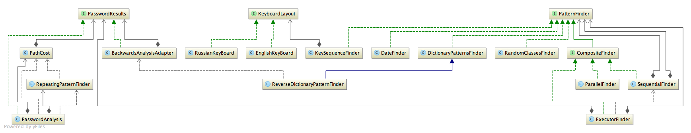
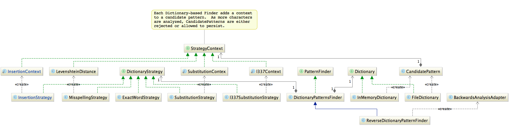

# OWASP Passfault Development

To analyse a password put the password into a `PasswordAnalysis` and pass it into a `PatternFinder`.
Any pattern finder will do but you can lump many pattern finders into a `CompositeFinder` like `SequentialFinder` or
`ExecutorFinder`

Here is a diagram of the core classes:

## Dictionary Finders

The `DictionaryPatternsFinder` is the most complex and deserves it's own diagram:

The `DictionaryPatternsFinder` takes multiple strategies and a dictionary.  It then analyzes the password by iterating
over each character - consulting with the strategies on each iteration.  For each iteration `CandidatePatterns` are created
and/or removed.  If a strategy confirms that a `CandidatePattern` is in fact a confirmed pattern it stores the pattern in
`PasswordAnalysis`.  If a strategy needs additional information, it can stored it on the `CandidatePattern` with a
`StrategyContext`.  For example, InsertionContext holds how many special characters have been inserted for the
`InsertionStrategy`.